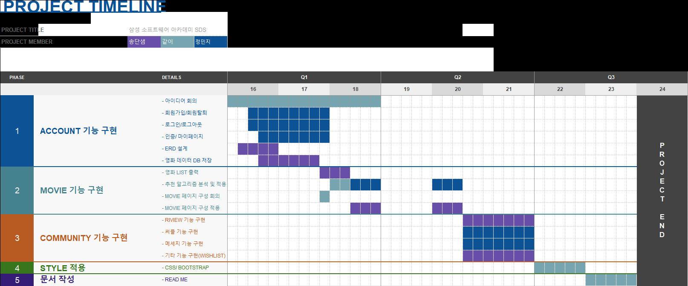
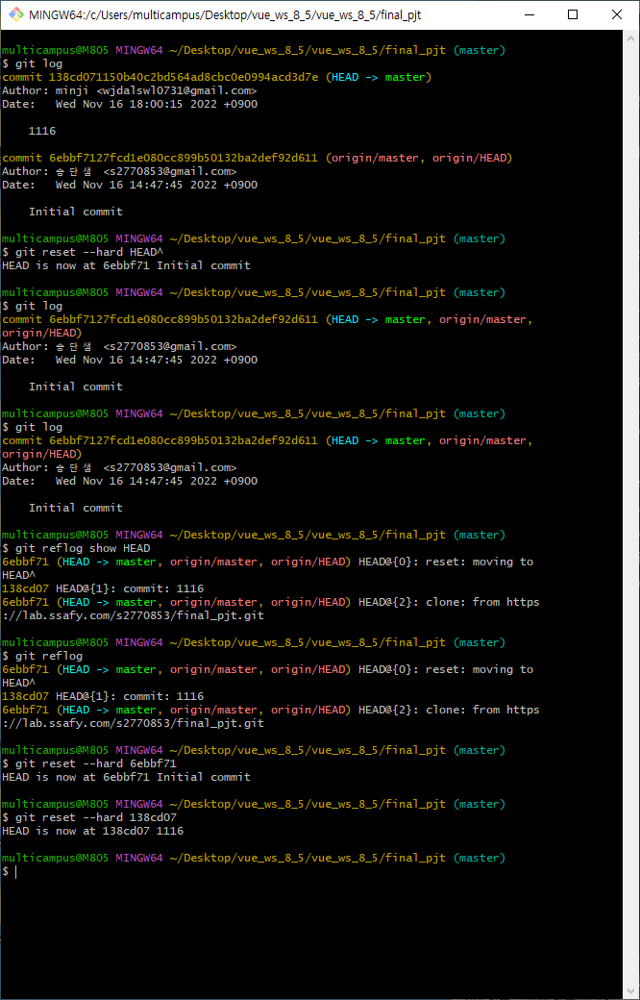
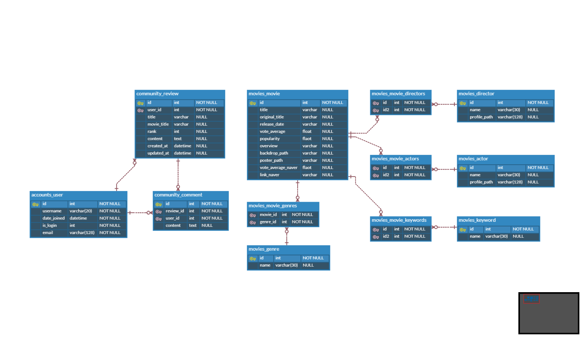
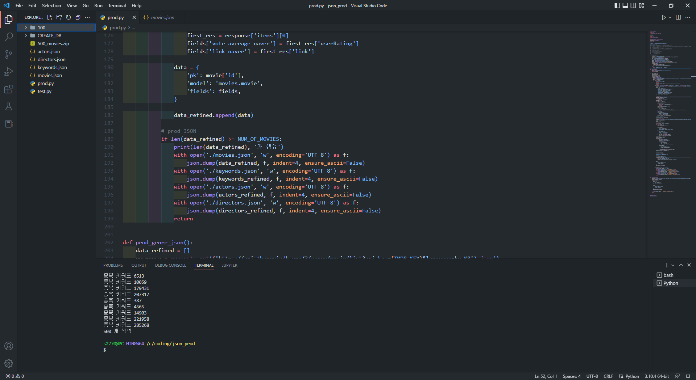
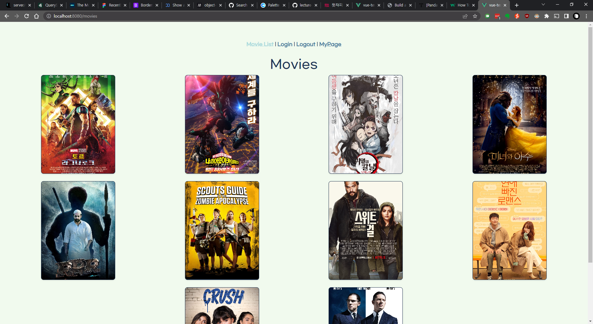
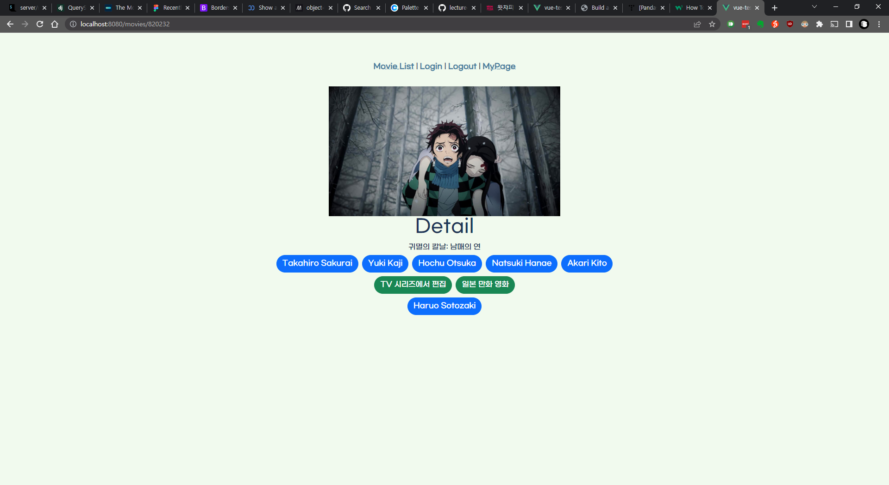

# final_pjt

일정표


# 11.16
11/16 수요일
- kakao 로그인 적용 ~ ing
  - [x] 로그인 적용해서 user 정보들 불러오기까지 진행했음,
  - [x]  회원가입 완성
- 로그인 했을 시 django 에서 jwt token 발행하는 법을 몰라서 해당 방법 찾는 중

# 11.17

```
add commit을 실수로 git ignore 빼고 해버려서
commit 되돌리려고 git reset --hard HEAD^ 를 진행,
다 날아가버림
복구를 위해서
git reflog 로 commit id 확인해서
git reset --hard <commit_id> 로 다시 복원
11/17 목요일 아침
일기
끗
```

> 익일 계획
> - 정민지 : 저녁에 카카오 로그아웃 구현 및 영화 추천 알고리즘 찾아보기
> - 송단샘 : db 넣기 마무리

# 11.18

> ERD 수정 : 테이블 추가

> migration 완료


> 일부 페이지 작성 중