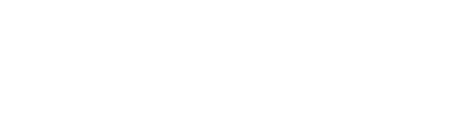
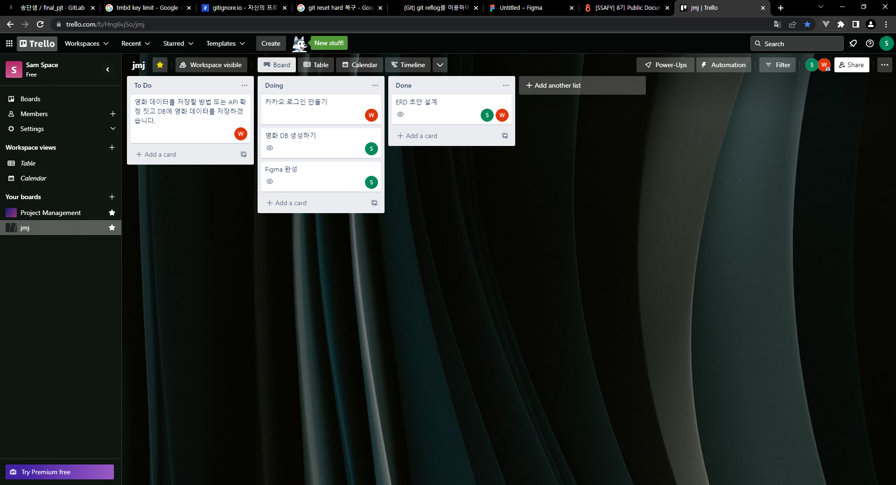
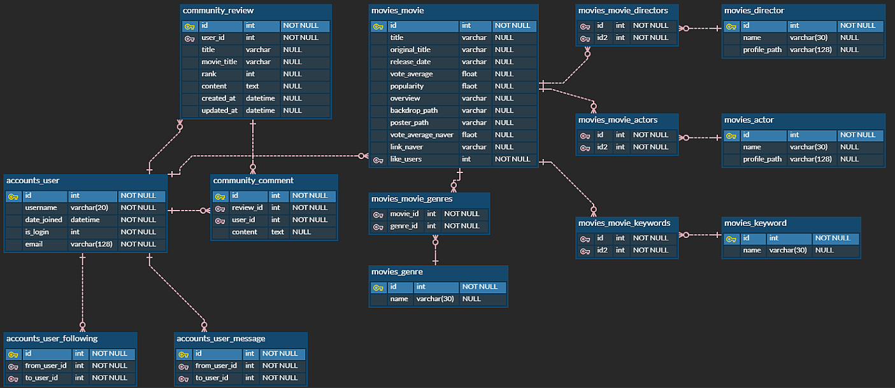
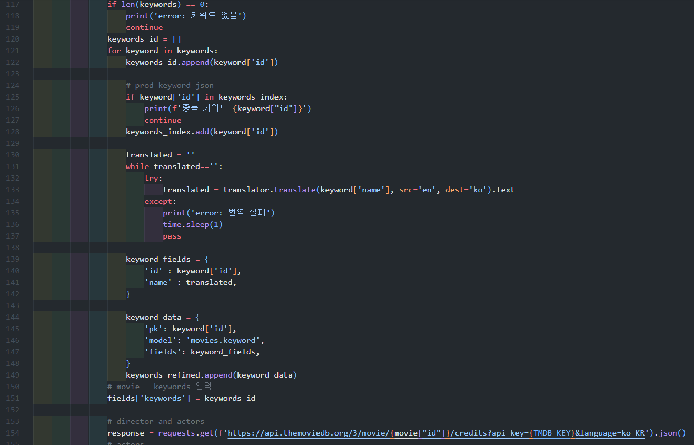
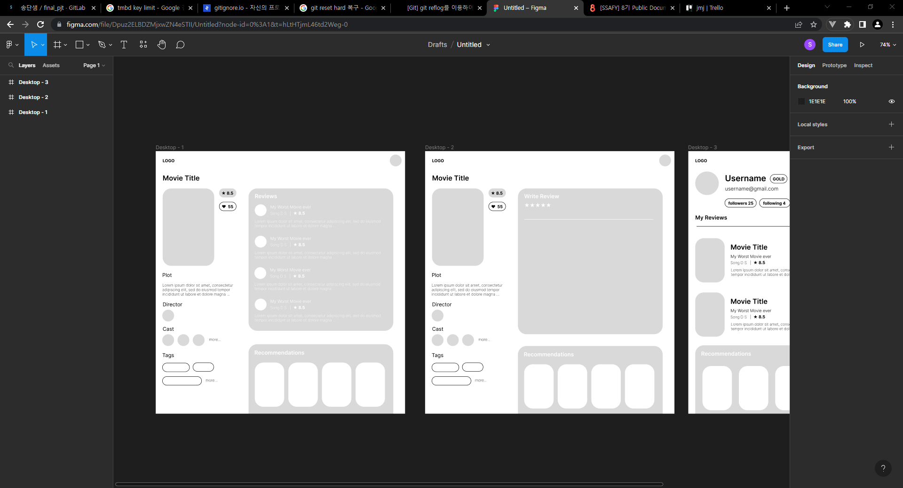
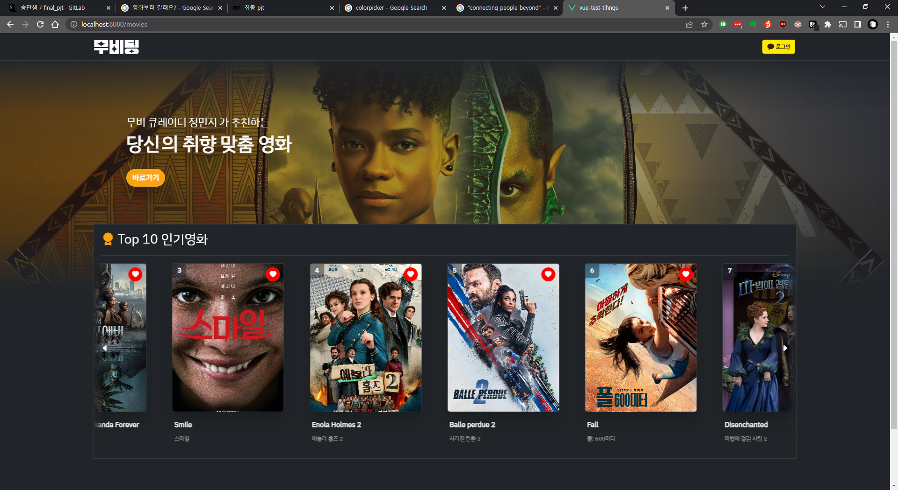
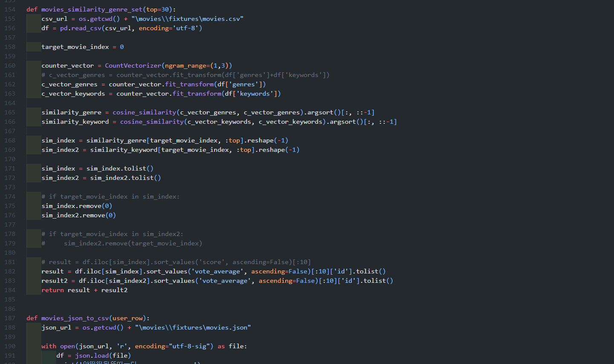
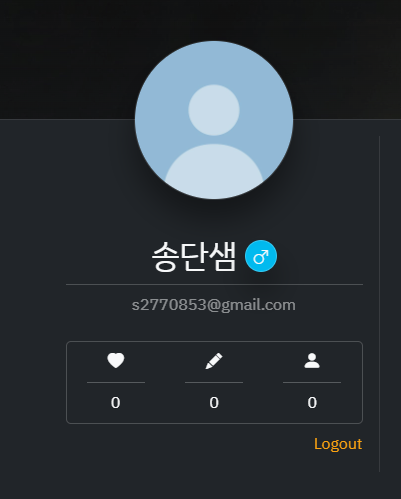
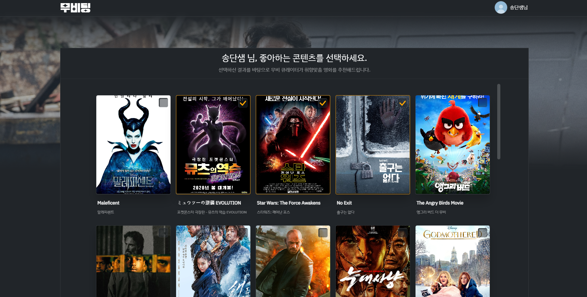
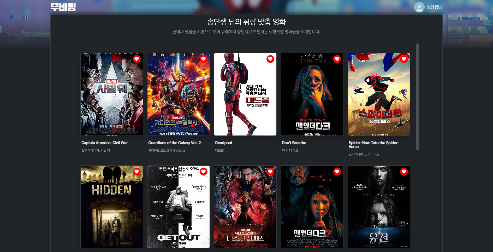

# final_pjt



- 송단샘

- 정민지

---

# 일정표


---

# 타임라인

### 11.16 (수)

- kakao 로그인 적용
  - [x] 로그인 적용해서 user 정보들 불러오기까지 진행했음,
  - [x] 회원가입 완성
- 로그인 했을 시 django 에서 jwt token 발행하는 법을 몰라서 해당 방법 찾는 중

#### 11.16 (목)


```
add commit을 실수로 git ignore 빼고 해버려서
commit 되돌리려고 git reset --hard HEAD^ 를 진행,
다 날아가버림
복구를 위해서
git reflog 로 commit id 확인해서
git reset --hard <commit_id> 로 다시 복원
```

> 익일 계획
> 
> - 정민지 : 저녁에 카카오 로그아웃 구현 및 영화 추천 알고리즘 찾아보기
> - 송단샘 : db 넣기 마무리

- 협업툴 Trello 채택


---

### 11.18 (금)

- ERD 작성


- 계획 변경에 따른 ERD 수정
  
  - 커뮤니티 기능을 위한 테이블 추가



- DB json fixture 파일 생성
  - TMDB 데이터 바탕으로 생성
  - 구글 trans API를 통해 키워드 번역
  - 네이버 API 통한 추가 데이터 수집

- 초안 레이아웃 작성

---
### 11.21(월)
- Figma 작성


- 전체적인 CSS 레이아웃 작성

- 키워드 기반 영화 파도타기
.PNG)
---
### 11.22(화)
- 추천 알고리즘 작성
> 1. movies_json_to_csv 함수에서 fixtures의 json 파일을 원하는 형식의 csv로 변환.
> 2. movies_similarity_genre_set 함수에서 CountVectorizer 의 counter_vector를 사용하여 장르, 키워드간 유사성이 있는 대상을 추출한다.
> 3. c_vector_genres = counter_vector.fit_transform(df['genres'])    c_vector_keywords = counter_vector.fit_transform(df['keywords'])라는 코드로 작성.
> 4. cosine 유사도인cosine_similarity를 사용, 비슷한 장르와 키워드인 영화들을 뽑아와서 병합한다.


---
### 11.23(수)
- 소설 로그인 완료
> 

> - js sdk 채용한 로그인.
> - kakao api 를 통해서kakao token으로 kakao 정보를 받는다.
> - 만약 kakao 로그인을 했는데 해당 정보가 우리 테이블에 없다면 바로 회원가입을 시켜주고 survey 로 리다이렉트.
> - survey 가 선택되면 그에 맞는 영화를 바로 추천 받을 수 있습니다
> - 이미 회원 테이블에 있으면 로그인만 가능.
> - 로그아웃 시 카카오 정책 때문에 전체 세션을 삭제할 수가 없었다.
> - 예를 들어 크롬에서 네이버나 카카오 로그인 한 번 해놓으면 계속 살아있는 것처럼 다른 탭 열어도 계속 정보가 남아있다.
> - 그래서 로그아웃은 api로 전달해 준다.
> - `카카오 계정과 함께 로그아웃`을 통해 세션을 삭제해 줄 수 있다.
---
### 11.21(목)
- 신규 회원 설문을 통한 취향 조사

- 취향 맞춤형 추천 폼 완성

---
### 정리
> - 다소 시간이 부족하여 완성된 서비스를 만들진 못했다는 아쉬움은 있지만, 작성 과정에서 git을 통한 branch 사용과 협업에 대해서 보다 숙련된 사용이 가능해졌다. 이해가 따르지 않았던 push/pull 과정은 생각보다 많은 어려움을 낳았다.
> - server/client 사이드를 특별히 구분하여 작업을 나누지 않고 작업하였는데 상호 간 성장을 도모할 수 있었다는 점에서 긍정적으로 작용했다.
> - css 부분은 기존 커리큘럼 상 깊게 다루지 않았는데 프로젝트 작업을 하면서 비약적으로 이해도가 올라갈 수 있었다. 다만 그만큼 투입된 시간이 많아져서 작업이 지체되고 말았다.
> - api를 활용하는 방법에 대한 경험을 쌓을 수 있어 다양한 기능을 접목하는 것의 망설임이 없어졌다. 소셜 로그인을 작성하는 과정에서 많은 애를 먹었는데 문제를 해결하는 과정에서 학습이 수반되었다.
